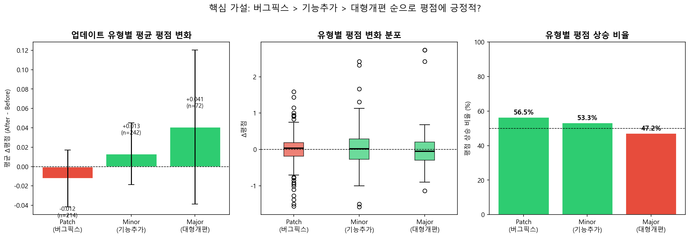
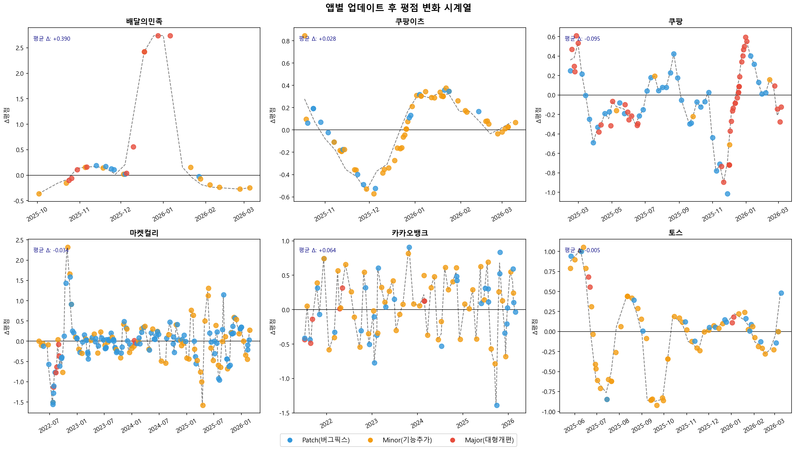
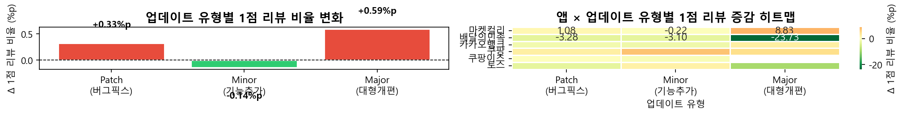

# 앱 업데이트 Before/After 평점 분석

> **"어떤 종류의 앱 업데이트가 평점을 올리고, 어떤 업데이트가 평점을 내리는가?"**
>
> 한국 대표 앱 6개(배달의민족·쿠팡이츠·쿠팡·마켓컬리·카카오뱅크·토스)의 버전 히스토리와
> Google Play 리뷰를 결합해, 업데이트 전후 ±30일 평점 변화를 정량 분석하고
> 부정 리뷰를 Claude로 자동 요약하는 파이프라인.
>
> 버전 히스토리는 별도 크롤링이 아니라 **리뷰의 `appVersion` 필드 첫 등장일**로 재구성
> (APKMirror가 한국 앱 미등재·403 차단이라 리뷰 데이터 자체에서 타임라인을 복원하는 우회 설계).

## 핵심 결과 (2026-04 스냅샷, 업데이트 528건 · 2021-07 ~ 2026-03)

| 업데이트 유형 | 평균 평점 변화 (±30일) | 건수 |
|---|---|---|
| **major** (주요 개편) | **+0.041** | 72 |
| **minor** (기능 추가) | +0.013 | 242 |
| **patch** (버그픽스) | **−0.012** | 214 |

- **큰 개편일수록 평점에 긍정적, 잦은 패치는 오히려 소폭 부정적** — "조용한 패치"가 쌓이는 구간에서 1점 리뷰 비율이 유지되는 패턴.
- 앱별 편차 큼: 배달의민족 평균 **+0.390** vs 쿠팡 **−0.095**.
- 최악 사례는 마켓컬리 3.49.0 (**−1.578**): Claude 부정 리뷰 요약이 "푸시 알림 거부 설정 무시 발송 버그"를 최다 불만으로 특정 — 평점 급락의 원인을 리뷰 텍스트에서 자동 진단.





## 파이프라인

```
1_collection/    리뷰 기반 버전 타임라인 재구성 + google-play-scraper 리뷰 (앱당 5,000건)
2_preprocessing/ 버전-리뷰 결합, 업데이트 전후 ±30일 윈도우 분리 → {app_id}_analysis.csv
3_eda/           가설 검증 노트북 (유형별 delta, 시계열, 1점 리뷰 집중 분석)
4_ai/            평점 급락 버전의 부정 리뷰를 Claude가 요약 → top_complaints/keywords/한줄 진단
5_dashboard/     Streamlit 대시보드 (plotly)
```

```bash
pip install -r requirements.txt
python 1_collection/apkmirror_scraper.py && python 1_collection/review_scraper.py   # 둘 다 google-play-scraper 기반
python 2_preprocessing/cleaner.py
python 4_ai/review_summarizer.py        # .env에 ANTHROPIC_API_KEY 필요
streamlit run 5_dashboard/app.py
```

## 데이터 산출물

- `data/processed/all_apps_analysis.csv` — 업데이트 528건 × (전후 평점, 1점/5점 비율, 리뷰 수)
- `data/processed/ai_summaries.json` — 평점 급락 상위 버전 10건의 LLM 진단 (불만 Top3, 키워드, 한 줄 조치 제안)

## 상태

- 분석 데이터는 **2026-04-22 수집 스냅샷** 기준.
- 주간 자동 수집 워크플로(`.github/workflows/weekly_collect.yml`, 매주 월요일)는 현재
  Claude 요약 단계에서 실패 중 (`ANTHROPIC_API_KEY` 시크릿 미설정) — 시크릿 등록 시 재가동.
